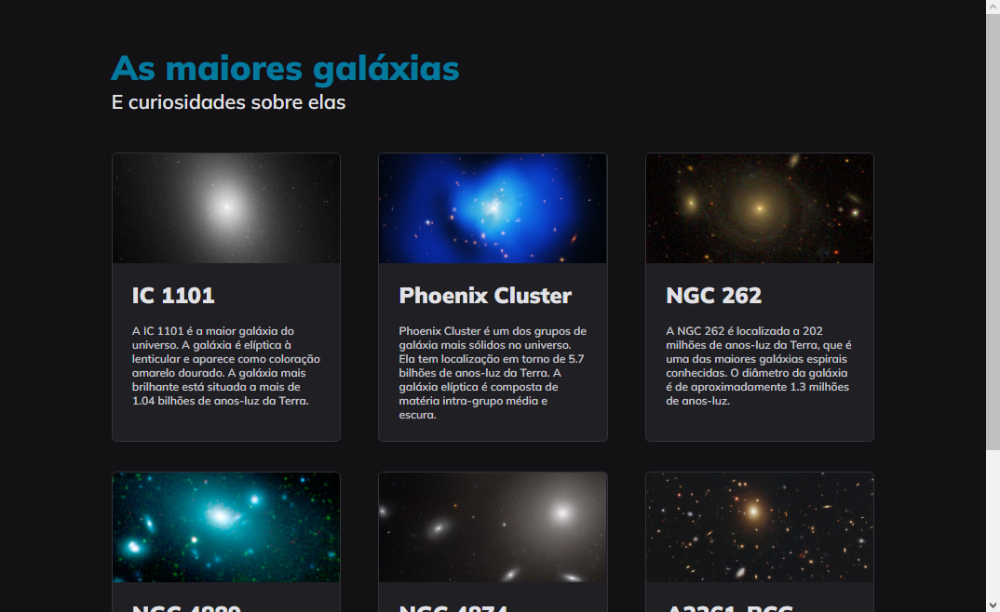

<h1 align="center"> As maiores galáxias </h1>

Projeto desenvolvido durante o desenvolvimento do curso Explorer da Rocketseat. 🚀🔥

  <a href="#-tecnologias">Tecnologias</a>&nbsp;&nbsp;&nbsp;|&nbsp;&nbsp;&nbsp;
  <a href="#-projeto">Projeto</a>&nbsp;&nbsp;&nbsp;|&nbsp;&nbsp;&nbsp;
  <a href="#-links">Links</a>

 

  

> Curso Explorer

Projeto simples, com o objetivo de treinar o Display Grid e suas aplicações. 💻❤️

## 🚀 Tecnologias

Esse projeto foi desenvolvido com as seguintes tecnologias:

- HTML 
- CSS
- Git & Github

   

## 💻 Projeto

Utiliza de tecnologias e linguagens básicas do navegador para apresentar as maiores galáxias conhecidas.

## 🔗 Links

 